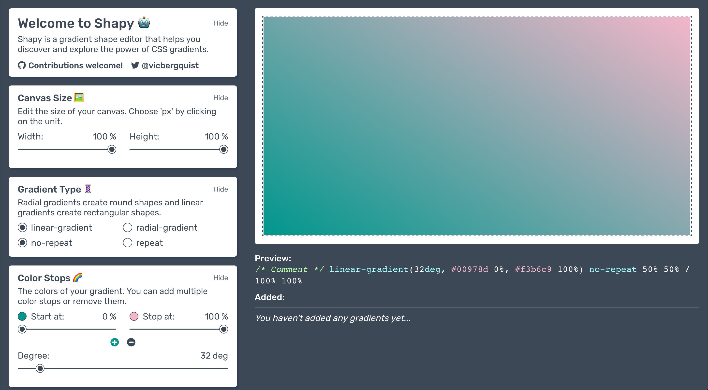

# shapy

Shapy is a gradient shape editor that helps you discover and explore the power of CSS gradients.

## Demo  

## [shapy.app](https://shapy.app/)



## Project setup
```
yarn install
```

### Compiles and hot-reloads for development
```
yarn run serve
```

### Compiles and minifies for production
```
yarn run build
```

### Run your tests
```
yarn run test
```

### Lints and fixes files
```
yarn run lint
```
